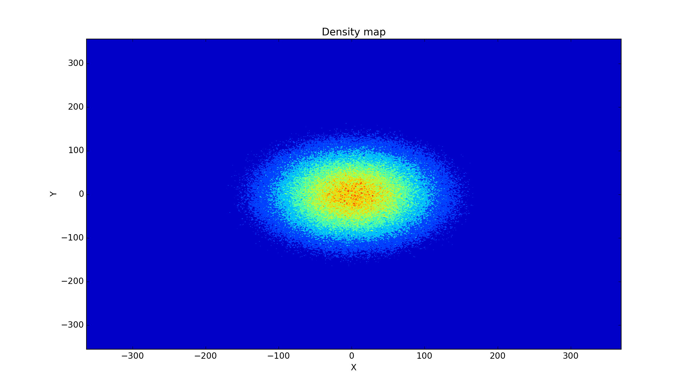
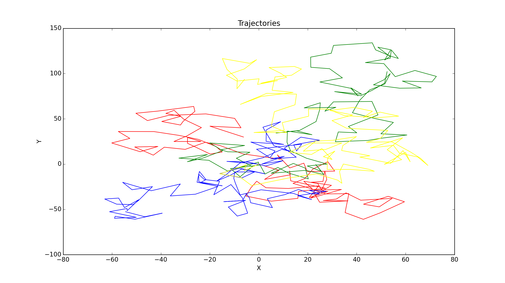

# Intel Xeon Phi programming practice

Implementing 2-d random walks and convection-deffusion equation solver.

Full texts of [tasks](https://docs.google.com/document/d/1wQQLKP5uD0-msZWFUC6sXm4gWRMAFrLqFPwHvjjLRdM/edit)

## Random walks

Purpose is to create a density map of points, yielded by Monte Carlo method of 1 million iterations of modeling 100 steps of Brownian motion from (0, 0).
An angel of rotation is uniformly distributed in [0, 2*pi) random variable and length of one step is normally distributed random variable with mean = 10, standart deviation = 3.

###Resulting samples:

#### Density Map:

#### Some particular paths:

